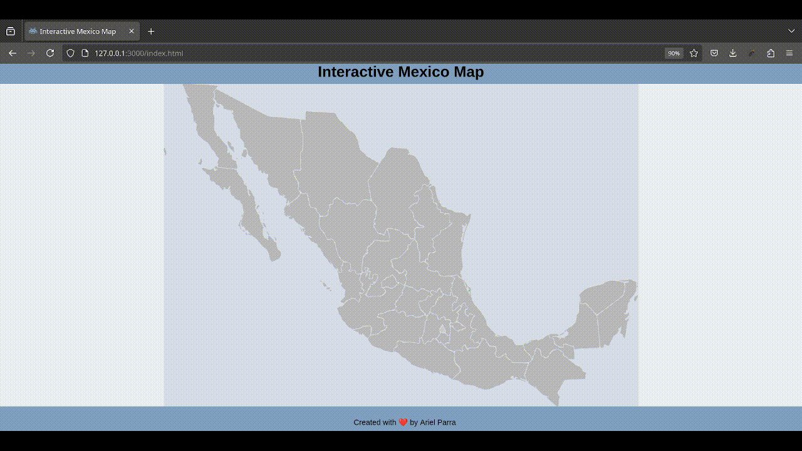

# Interactive Mexico Map

An interactive map of Mexico built using the official SVG map from Wikipedia. This project highlights states on hover and displays information on click using plain JavaScript.

## Features

- **Interactive Map**: Hover over states to highlight them.
- **State Information**: Click on a state to display its name and additional data in an information box.
- **Tooltip**: A tooltip follows the cursor, showing the state's name on hover.
- **Responsive Design**: The map is centered and adjusts dynamically to the viewport.

## Credits

**SVG Map**:  
[`mexico-map.svg`](https://upload.wikimedia.org/wikipedia/commons/2/23/Mexico_Map.svg) by Allstrak, licensed under [CC BY-SA 3.0](https://creativecommons.org/licenses/by-sa/3.0/).  
Source: [Wikimedia Commons](https://commons.wikimedia.org/wiki/File:Mexico_map.svg).

## License

This project is licensed under the MIT License. See the [LICENSE](LICENSE) file for details.
